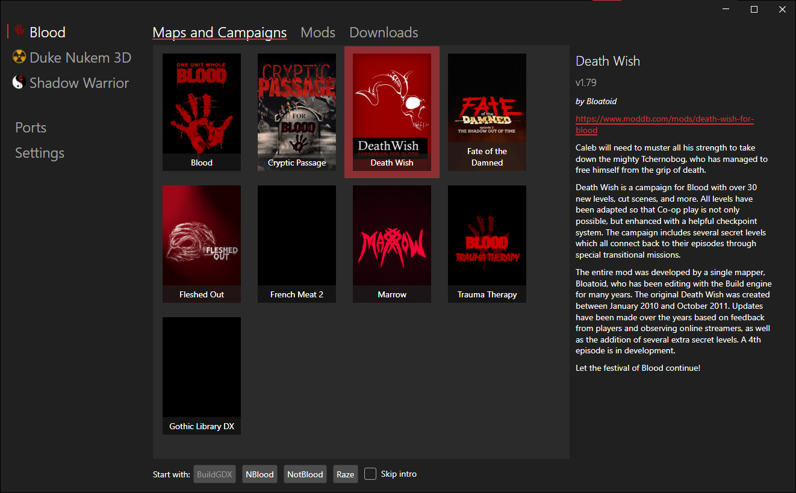

<table>

<tr>
<td align="center" valign="middle">
<b>What is BuildLauncher</b>
</td>
</tr>

<tr>
<td valign="center">

<b>BuildLauncher</b> is a frontend for Build Engine games inspired by *nstlaurent's* [DoomLauncher](https://github.com/nstlaurent/DoomLauncher)

It can download all major ports for Build Engine games, as well as mods, custom campaigns, and maps and launch them with the port of your choice.

Another goal of this project is to create a unification standard for Build Engine mods, campaigns, and map, so they can be launched with supported ports without any additional tweaking by users.

</td>
</tr>

<tr>
<td align="center" valign="middle">
<b>Supported games</b>
</td>
</tr>

<tr>
<td valign="center">

- Duke Nukem 3D (including Caribbean, Nuclear Winter, Duke it out in DC, World Tour and  Duke 64)
- Shadow Warrior (including Wanton Destruction and Twin Dragon)
- Blood (including Cryptic Passage)

</td>
</tr>

<tr>
<td align="center" valign="middle">
<b>What it can do</b>
</td>
</tr>

<tr>
<td valign="center">

- Download and update all major source ports for Build Engine games
- Download custom maps, campaigns and mods for supported games
- Launch original games, their addons can custom content with the port of your choice
- Create Would Tour Stopgap for EDuke32 automatically
- Create combined autoload mod for EDuke32 and its forks, so more than one autoload mod can work at the same time
- Keep saved games for custom content in separate folders (only for Raze so far)

</td>
</tr>

<tr>
<td align="center" valign="middle">
<b>What's planned</b>
</td>
</tr>

<tr>
<td valign="center">

- Support for more Build Engine games
- Support for BuildGDX and DOSBox
- More downloadable maps, campaigns and mods
- Downloaded content auto update
- Ability to turn autoload mods off and on
- Better support for custom content that's not downloaded from the launcher
- Support for loose .map files
- Linux/Deck version

</td>
</tr>

<tr>
<td align="center" valign="middle">
<b>How to use</b>
</td>
</tr>

<tr>
<td valign="center">

Download latest release for your platform from <a href="https://github.com/fgsfds/BuildLauncher/releases">release page</a>

Unpack zip archive anywhere and run <b>BuildLauncher.exe</b>

</td>
</tr>

</table>

 <a href="https://discord.gg/mWvKyxR4et">Join my Discord server</a>
