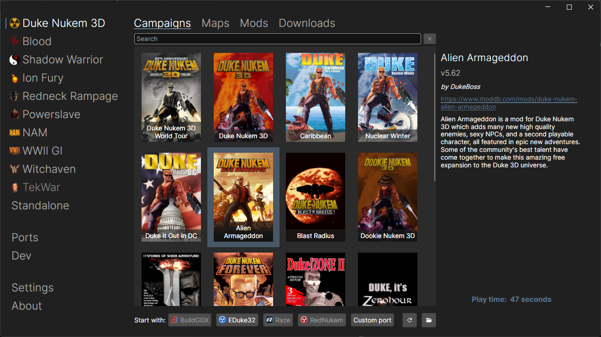
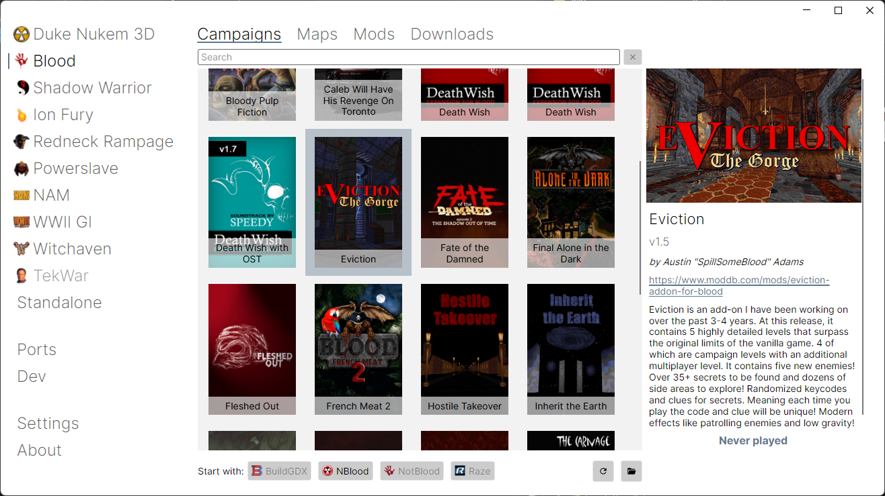
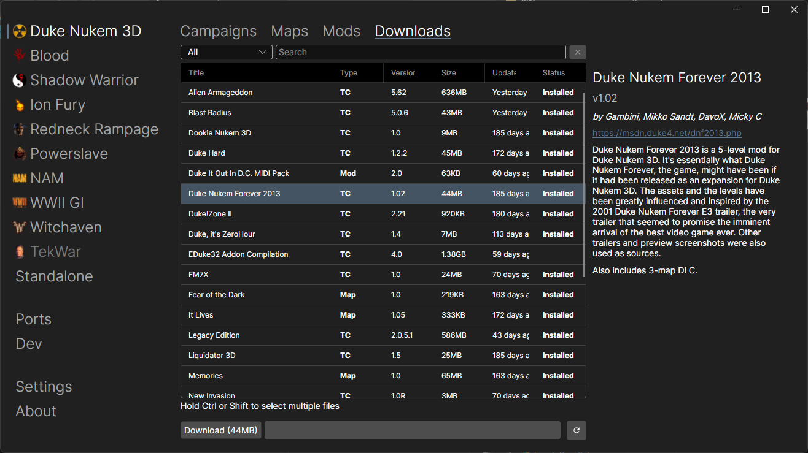

<table>

<tr>
<td align="center" valign="middle">
<b>What is BuildLauncher</b>
</td>
</tr>

<tr>
<td valign="center">

<b>BuildLauncher</b> is a frontend for Build Engine games inspired by *nstlaurent's* [DoomLauncher](https://github.com/nstlaurent/DoomLauncher)

It can download all major ports for Build Engine games, as well as mods, custom campaigns, and maps and launch them with the port of your choice.

Another goal of this project is to create a unification standard for Build Engine mods, campaigns, and map, so they can be launched with supported ports without any additional tweaking by users.

</td>
</tr>

<tr>
<td align="center" valign="middle">
<b>Supported games</b>
</td>
</tr>

<tr>
<td valign="center">

- Duke Nukem 3D (including Caribbean, Nuclear Winter, Duke it out in DC, World Tour and Duke 64)
- Shadow Warrior (including Wanton Destruction and Twin Dragon)
- Blood (including Cryptic Passage)
- Redneck Rampage, Route 66 and Rides Again
- Ion Fury
- Powerslave
- NAM
- World War II GI
- Witchaven I & II
- TekWar
- and standalone Build Engine games

</td>
</tr>

<tr>
<td align="center" valign="middle">
<b>What it can do</b>
</td>
</tr>

<tr>
<td valign="center">

- Automatically detect Build Engine games installed from Steam or Zoom platform (GOG support will be added later)
- Download and update all major source ports for Build Engine games
- Download custom maps, campaigns and mods for supported games
- Launch original games, their addons, and custom content with the port of your choice without any tweaking and manual installing
- Load multiple mods at the same time without manually editing .def files
- Keep saved games for custom content in separate folders
- Track your playtime for games and custom content
- Create Would Tour Stopgap for EDuke32 automatically
- Run Route 66 with RedNukem without renaming original files

</td>
</tr>

<tr>
<td align="center" valign="middle">
<b>How to use</b>
</td>
</tr>

<tr>
<td valign="center">

Download latest release for your platform from <a href="https://github.com/fgsfds/BuildLauncher/releases">release page</a>

Unpack zip archive anywhere and run <b>BuildLauncher.exe</b>

</td>
</tr>

<tr>
<td align="center" valign="middle">
<b>More</b>
</td>
</tr>

<tr>
<td valign="center">

Want to create and submit your own addons? Learn about addons specifications? Care about security and privacy?

**Check [WIKI](https://github.com/fgsfds/BuildLauncher/wiki) for more information.**

</td>
</tr>

<tr>
<td align="center" valign="middle">
<b>Disclaimer</b>
</td>
</tr>

<tr>
<td valign="center">

**BuildLauncher** is a community-driven utility designed to help users manage and launch third-party source ports, mods, custom campaigns, and maps for their licensed Build Engine games.

This Software is not affiliated with or endorsed by the original game rights holders or any associated entities.

Use this Software and the associated content at your own discretion. Please be aware that using third-party modifications may occasionally lead to game instability or technical conflicts. While we aim for a seamless experience, we cannot guarantee the performance or compatibility of external content.

**The developers of this Software are not responsible for any technical issues or data loss that may arise from using community-made fixes.**

<tr>
<td align="center" valign="middle">
<b>Sponsors</b>
</td>
</tr>

<tr>
<td>

	Free code signing provided by <a href="https://about.signpath.io/"><b>SignPath.io</b></a>, certificate by <a href="https://signpath.org/"><b>SignPath Foundation</b></a>

</td>
</tr>

<tr>
<td align="center" valign="middle">
<b>Links</b>
</td>
</tr>

<tr>
<td>

	 <a href="https://discord.gg/mWvKyxR4et"><b>Discord</b> server</a>

</td>
</tr>

</td>
</tr>

</table>
